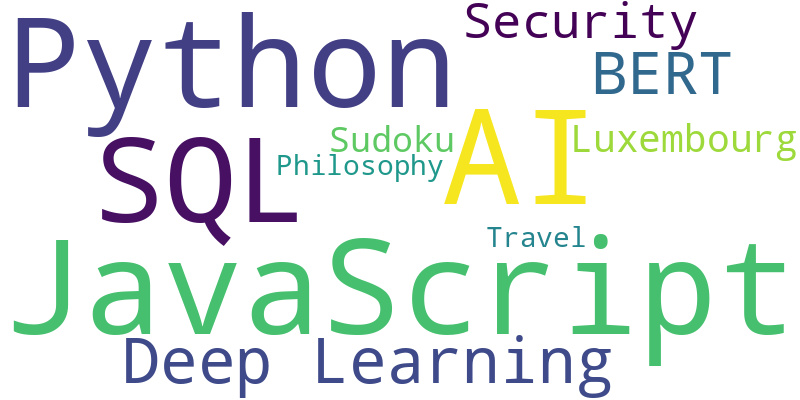

### Hey there 👋 I'm André

I'm a **Computer Science graduate** and current **Data Science Master's student** at the University of Luxembourg 🇱🇺.  
Previously, I worked as a **Back-End Developer** at Plan Software GmbH in Saarbrücken 🇩🇪.

I'm passionate about using **data, algorithms, and creativity** to solve real-world problems—especially when it comes to AI, cybersecurity, and digital ethics. Always open to collaboration and learning something new.

---

### 🧠 What I'm Interested In

- 🔐 CyberSec
- 🤖 Artificial Intelligence & Deep Learning & Large Language Models
- 🧬 Bioinformatics 
- 💬 Natural Language Processing
- 🌐 Full-stack Web Development
- 📊 Data Analytics & Visualization

---

### 🚀 Projects I'm Proud Of

- **Robust CAPTCHA with AI** – Built secure visual challenges using MNIST and Genetic Algorithms  
- **Hate Speech Detection** – Built a BERT pipeline for classifying social media text  
- **Sudoku Zero-Knowledge Proof** – Proved solutions without revealing them (yes, it’s possible!)  
- **YouTube Video Classifier** – Categorized public videos via REST APIs and web scraping  

---

### 🌍 Where Tech Meets Life

Besides tech, I'm into:

🎸 Playing guitar | 🏹 Archery | ✈️ Traveling | 📈 Stock Market  
🧘‍♂️ Meditating | 🎵 Music | 💭 Philosophy

---

### ☁️ My Word Cloud



---

### 🛠️ Tools & Technologies

```text
Languages: JavaScript, Python, SQL, Java, HTML/CSS, R  
Frameworks: Node.js, Express, TensorFlow, scikit-learn  
Tools: Git, JIRA, VSCode, Postman, MS Excel  
Concepts: Agile (Scrum/OKR), Data Cleaning, API Design, Testing (White-box/Black-box)
